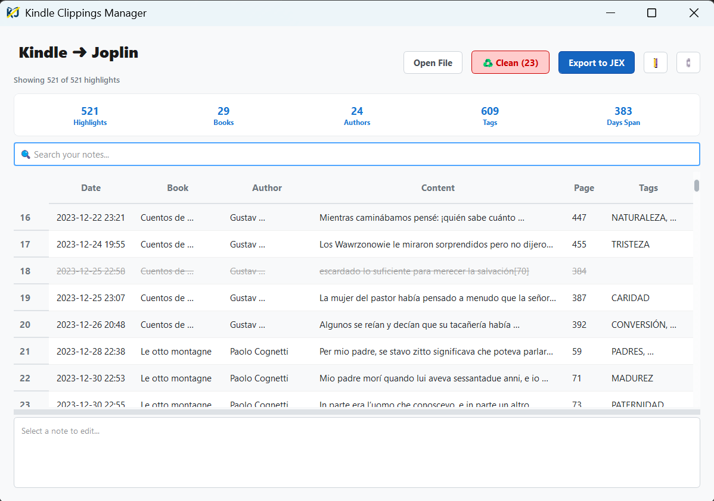
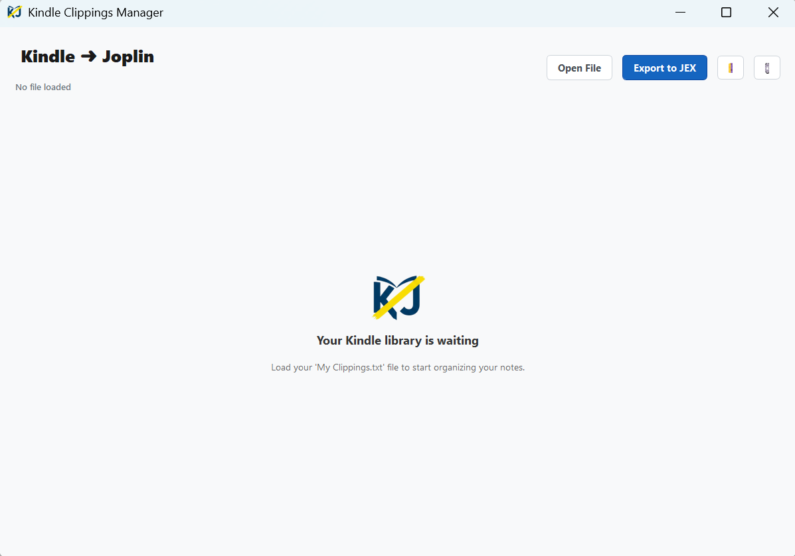
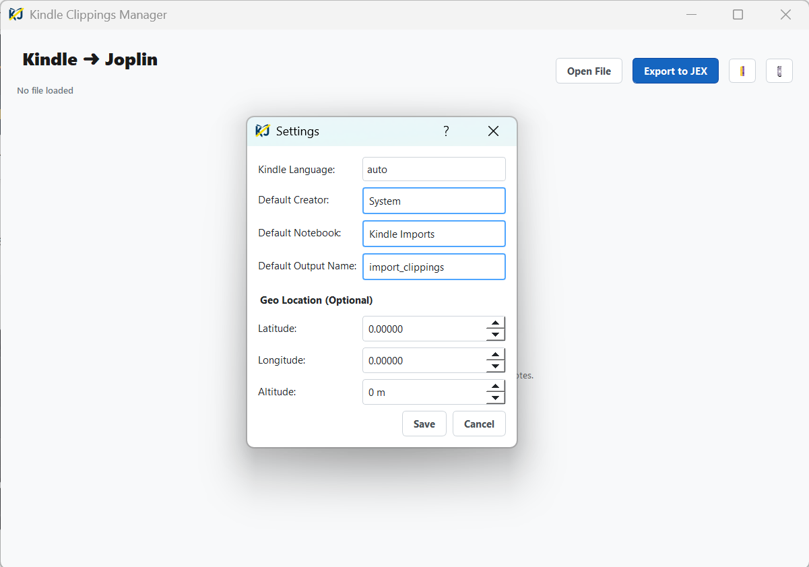

# KindleClippingsToJEX


[](https://github.com/KindleTools/KindleClippingsToJEX/actions)
[](https://github.com/KindleTools/KindleClippingsToJEX/actions/workflows/quality.yml)
[](https://github.com/KindleTools/KindleClippingsToJEX/releases/latest)
[](https://github.com/astral-sh/ruff)

**KindleClippingsToJEX** is a robust, professional-grade tool designed to process your Kindle highlights (`My Clippings.txt`) and convert them into a **Joplin Export File (.jex)**. It preserves all critical metadata (author, book, date, page/location) and intelligently organizes them into a clean notebook structure ready for direct import into [Joplin](https://joplinapp.org/).

<p align="center">
  
</p>

Whether you are a casual reader or a power user, this tool ensures your Kindle notes are never lost and always accessible in your favorite note-taking app.

---

## 📑 Table of Contents
- [Features](#-features)
- [Download](#-download)
- [Installation](#-installation)
- [Configuration](#-configuration)
- [Usage (GUI & CLI)](#-usage)
- [Project Structure](#-project-structure)
- [Future Improvements](#-future-improvements)
- [Troubleshooting](#-troubleshooting)
- [Acknowledgements](#-acknowledgements)
- [Contributing](#-contributing)
- [License](#-license)

---

## Features

### 🚀 Core Functionality
- **JEX Native Export**: Generates standard `.jex` files (tarball of markdown files + JSON metadata) that import flawlessly into Joplin, preserving creation dates and official titles.
- **CSV Export**: Optionally export your curated highlights to a standardized **CSV** format, perfect for importing into Excel, Notion, or other database tools. Uses UTF-8-SIG encoding for maximum compatibility with Microsoft Excel.
- **Markdown Export (Obsidian)**: Generates a **.zip** archive containing individual `.md` files for each note. Each file includes YAML frontmatter (title, author, tags, date), making it fully compatible with **Obsidian**, Logseq, and other PKM tools.
- **JSON Export**: Export raw data in **JSON** format for developers, backups, or custom processing scripts.
- **Enhanced Metadata Extraction**: Intelligently extracts author names, book titles, locations, and page numbers. It even handles page numbers with zero-padding (e.g., `[0042]`) to ensure proper lexical sorting.
  - **Geo-tagging Support**: Optionally add location data (lat/long/altitude) to your imported notes via `config.json`. Joplin uses this to display your notes on a map (via OpenStreetMap).
- **Smart Synchronization System**: Say goodbye to duplicates!
  - **Deterministic IDs**: Generates stable, content-based IDs (SHA-256) for every note, notebook, and tag. This means you can re-export your Kindle file 100 times, and Joplin will intelligently **update** your existing notes instead of creating messy duplicates.
- **Smart Tagging**: Converts your Kindle notes into Joplin tags. Supports splitting multiple tags by comma, semicolon, or period (e.g., "productivity, psychology").
- **Smart Deduplication**: Intelligent algorithm that detects and merges:
  - **Overlapping highlights**: Keeps the longest/most complete version of a correction.
  - **Edited Notes**: Keeps only the latest version of a note at a specific location.
  - **Accidental Highlights**: Flags fragments (< 75 chars) if they start with lowercase or lack punctuation.
- **Smart Association**: Advanced logic to link notes to highlights even when Kindle places the note at the *end* of a long passage. Instead of exact matching, it uses sophisticated range coverage (Highlight Start ≤ Note Location ≤ Highlight End) to ensure your comments always find their parent text.
- **Advanced Text Hygiene**: Automatically polishes your highlights to professional standards:
  - **Title Polishing**: Automatically cleans up book titles by removing clutter like " (Kindle Edition)", "(Spanish Edition)", "[eBook]", etc.
  - **Unicode (NFC) Normalization**: Ensures cross-platform compatibility (Windows/Mac/Linux) for special characters, preventing issues with Obsidian/Joplin search and linking.
  - **Typesetting Cleanup**: Fixes common Kindle issues like double spaces, spaces before punctuation (e.g., `Hello , world`), and capitalization errors.
  - **De-hyphenation**: Fixes broken words from PDF line breaks (e.g., `word-\n suffix` → `wordsuffix`).
  - **Invisible Character Removal**: Strips byte-order marks (BOM) and zero-width spaces that often corrupt text searches.
- **Robustness & Transparency**:
  - **Detailed Error Reporting**: Intelligently skips corrupted blocks and provides a visual report with snippets of exactly what was skipped, ensuring data integrity without silent failures.
  - **Comprehensive Logging**: Maintains a full audit trail (info, debug, errors) of the process in `app.log` for troubleshooting.
  - **Strict Typing**: Built with Python Dataclasses to prevent data corruption.
- **Multi-language Support**: Automatic language detection from the clippings file, with manual override support. Supported languages: English, Spanish, French, German, Italian, and Portuguese.

### 🎨 "Zen" Graphical User Interface
The project features a completely redesigned, modern "Zen" interface focused on simplicity, focus, and efficiency.

#### Key GUI Features:
- **Instant Auto-Load**: Automatically detects and loads your configured clippings file on startup. If not found, a friendly "Empty State" guides you.
- **Kindle Auto-Detection**: Scans connected USB drives (Windows, macOS, Linux) for a Kindle device and offers to import directly.
- **Drag & Drop**: Simply drag your `My Clippings.txt` file onto the window to load it instantly.
- **Smart Cleanup**: A **"♻️ Clean"** button appears automatically if duplicates or redundant highlights are detected. One click cleans up your file.
- **🌗 Light / Dark Mode**: Toggle between light and dark themes with one click. Your preference is saved in `config.json`.
- **Live Stats Dashboard**: The header updates in real-time to show statistics like **Highlights**, **Books**, **Authors**, **Tags**, **Avg/Book**, and **Days Span**.
- **Clean Data Table**: A clutter-free table view focusing on what matters:
  - **Date**: Sortable by timestamp.
  - **Book**: Filterable title.
  - **Author**: Filterable author name.
  - **Content**: Smart preview that expands on double-click.
  - **Tags**: Editable tags column (comma-separated).
- **Smart Search**: Real-time filtering by text. Type "Harry" and instantly see only related notes. The export function respects this filter ("What You See Is What You Get").
- **Bidirectional Editing**:
  - Edit text directly in the table cells.
  - OR use the spacious **Bottom Editor Pane** for long texts.
  - Changes are synced instantly between views.
- **Power Selection & Context Menu**:
  - **Multi-select**: Use `Shift+Click` or `Ctrl+Click` to select multiple rows.
  - **Right-Click Menu**:
    - **Export Selected**: Create a mini .jex file containing ONLY the selected notes.
    - **Duplicate**: Clone a row (useful for splitting one long highlight into two distinct notes).
    - **Delete**: Remove unwanted highlights before exporting.

<p align="center">
  
  
</p>

### 💻 Command Line Interface (CLI)
For power users and automation scripts, the CLI offers a headless experience.

- **Batch Processing**: Process huge files in seconds without opening the window.
- **Configurable**: Fully controlled via arguments or `config.json`.

## 📥 Download

**Don't want to mess with Python or code?**

Simply download the latest executable for your system from the **[Releases Page](../../releases/latest)**.
- **Windows**: `KindleToJEX-Windows.exe`
- **Mac**: `KindleToJEX-MacOS`
- **Linux**: `KindleToJEX-Linux.bin`

## Installation

1. **Clone the repository:**
   ```bash
   git clone https://github.com/KindleTools/KindleClippingsToJEX.git
   cd KindleClippingsToJEX
   ```

2. **Create a virtual environment (Recommended):**
   ```bash
   python -m venv .venv
   # Windows
   .\.venv\Scripts\activate
   # Linux/Mac
   source .venv/bin/activate
   ```

3. **Install dependencies:**
   ```bash
   # For users (minimal install):
   pip install -e .

   # For contributors (includes linting, testing, and build tools):
   pip install -e .[dev]
   ```

4. **Build the Executable (Optional):**
   Simply double-click `build_exe.bat` on Windows to generate a standalone `.exe` in the `dist/` folder.

   > **Note for Mac/Linux Users:** To build efficiently for all platforms without needing multiple computers, this project includes a **GitHub Actions** workflow. Simply create a "Release" in your GitHub repository, and it will automatically build and attach `.exe` (Windows), `.bin` (Linux), and Mac executables.

## Configuration

The application uses a `config/config.json` file for default settings. You can copy `config/config.sample.json` to get started.

```json
{
    "creator": "Your Name",
    "notebook_title": "Kindle Imports",
    "input_file": "path/to/My Clippings.txt",
    "output_file": "import_clippings",
    "language": "auto",
    "theme": "light",
    "location": [0.0, 0.0, 0]
}
```

| Key | Description |
|-----|-------------|
| `creator` | Your name (used as author metadata in exported notes). |
| `notebook_title` | Root notebook name in Joplin for the import. |
| `input_file` | Default path to your `My Clippings.txt` file. |
| `output_file` | Base name for the exported file (extension added automatically). |
| `language` | Parsing language: `auto` (recommended), `en`, `es`, `fr`, `de`, `it`, or `pt`. |
| `theme` | GUI theme: `light` or `dark`. |
| `location` | Geo-tagging as `[latitude, longitude, altitude]`. Joplin displays this on a map via OpenStreetMap. Set to `[0, 0, 0]` to disable. |

## Usage

### Using the GUI

Run the main application entry point:
```bash
python main.py
```

**Workflow:**
1. **Load**: The app opens your default clippings file. If missing, click **"Open File"**.
2. **Curate**:
   - Use the **Search Bar** to filter by book title or content.
   - Use **Ctrl+Click** to select specific notes.
   - Right-click and select **"Delete Row(s)"** to remove irrelevant highlights.
   - Edit the **Content** or **Tags** columns to fix typos or add context.
3. **Export**:
   - **Export Visible**: Click the main **"Export Notes"** button. You can choose between **JEX** (for Joplin), **CSV** (for Excel), **Markdown ZIP** (for Obsidian), or **JSON**.
   - **Export Selection**: Select specific rows, Right-Click > **"Export Selected"** to save just those notes (JEX, CSV, ZIP, or JSON).
4. **Import**:
   - **Joplin**: Go to **File > Import > JEX - Joplin Export File**.
   - **Obsidian**: Unzip the downloaded file and drag the folder into your Obsidian Vault.
   - **Excel**: Open the generated CSV file directly.

### Using the CLI

Run the CLI script:
```bash
python cli.py
```

**Options:**
- `--input`, `-i`: Path to source file (default: from config).
- `--output`, `-o`: Output filename (default: from config).
- `--lang`, `-l`: Force language parsing (e.g., `en`).
- `--notebook`, `-n`: Root notebook title for the export (default: "Kindle Imports").
- `--creator`, `-c`: Author name metadata for the notes (default: "System").
- `--format`, `-f`: Output format: `jex`, `csv`, `md`, or `json`.
- *Note*: The CLI automatically applies **Smart Deduplication** unless `--no-clean` is used.
- `--no-clean`: Disable the smart deduplication and accidental highlight cleaning.

Example:
```bash
python cli.py --input "data/old_clippings.txt" --no-clean
```

## Project Structure

The project follows a modular hexagon-like architecture to separate UI, Business Logic, and Data Parsing. See [ARCHITECTURE.md](docs/ARCHITECTURE.md) for design decisions and rationale.

```
├── .github/                       # CI/CD Workflows (GitHub Actions)
├── config/                        # Configuration Settings
├── docs/                          # Architecture & Design Documentation
├── domain/                        # Data Models (DDD Dataclasses)
├── exporters/                     # Export Strategies (JEX, CSV, MD, JSON)
├── parsers/                       # Kindle Parsing Logic (Multi-language)
├── resources/                     # Static Assets (Icons, Styles, Language Patterns)
├── services/                      # Business Logic & Orchestration
├── tests/                         # Unit & Integration Tests
├── ui/                            # GUI Layer (PyQt5)
├── utils/                         # Shared Utilities & Logging
├── build_exe.bat                  # Windows Build Script
├── cli.py                         # CLI Entry Point
├── main.py                        # GUI Entry Point
└── pyproject.toml                 # Project Definition
```

## Development & Testing

To set up the development environment:

```bash
# Install all dependencies (app + dev tools: ruff, pytest, mypy, coverage, pyinstaller)
pip install -e .[dev]
```

Run quality checks:
```bash
# Type Checking
mypy .

# Linting & Formatting
ruff check .
ruff format .
```

Run the test suite:

```bash
# Run all tests
pytest

# With coverage report
coverage run -m pytest
coverage report -m
```

## Future Improvements
The following are the next planned features. See the full [Roadmap](roadmap.md) for the complete multi-phase development plan.

- **🔌 Direct Joplin Sync**: Send notes directly to the running Joplin app via its local API (Port 41184), skipping the file import step.
- **🗃️ SQLite Backend**: Persistent database for highlights with edit history and undo/redo.
- **📅 Reading Timeline**: A visual heatmap or bar chart to visualize your reading habits over time.
- **📚 Book Cover Enrichment**: Automatic cover art via Open Library API for a visual "bookshelf" experience.
- **🧠 AI Auto-Tagging**: Zero-Shot classification for automatic highlight categorization.

## 💡 Troubleshooting

**The app doesn't detect my Kindle automatically.**
> Ensure your Kindle is connected via USB and recognized as a drive by your computer. The app looks for `documents/My Clippings.txt` in standard drive letters.

**My highlights have the wrong encoding (weird characters).**
> The app tries to auto-detect UTF-8 or UTF-8-SIG. If you see weird characters, open `config/config.json` and try changing your system language settings or saving your clippings file as UTF-8.

**I see "No module named ui" errors when running from source.**
> Make sure you are running the script from the root directory: `python main.py`, not from inside a subdirectory.

## 🤝 Acknowledgements

Special thanks to the open-source libraries that make this possible:
- **[PyQt5](https://riverbankcomputing.com/software/pyqt/intro)** for the beautiful GUI framework.
- **[dateparser](https://dateparser.readthedocs.io/)** for the magical multi-language date parsing.
- **[Pillow](https://python-pillow.org/)** for image processing (icon conversion for cross-platform builds).
- **[Joplin](https://joplinapp.org/)** for providing an excellent note-taking ecosystem.

## Contributing

Contributions are welcome! Please check [CONTRIBUTING.md](CONTRIBUTING.md) for guidelines on code style (PEP 8) and pull requests.

## License

This project is licensed under the MIT License - see the [LICENSE](LICENSE) file for details.
